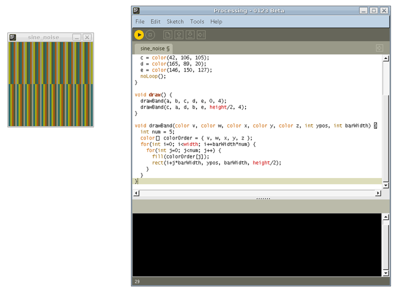

# Dataviz with Processing 101

par [Clément Renaud](http://clementrenaud.com)

Texte et exemples du workshop dispo [http://clementrenaud.com/uploads/Dataviz101](http://clementrenaud.com/uploads/Dataviz101)

## Objectifs

* Comprendre les enjeux pratiques de la visualisation de données
* Utiliser un langage de programmation (Processing)
* Réaliser une application d'analyse de texte

## Outils

### Processing

* créé par 2 artistes américains Benjamin Fry et Casey Reas
* création graphique et interactive pour les non-codeurs
* principe majeur : la simplicité
* basé sur Java, donc beaucoup de librairies et composants dispo
* arts numériques, graphisme, visualisation, graphisme génératif...
* parfois appelé ``p5``
* existe désormais pour le Web (processing.js)

### Interface



Quelques raccourcis bien pratiques :

* CTRL+R > ``Run`` pour démarrer votre sketch
* CTRL+T > ``Tabulation`` pour indenter le code.

### Hello World

    print("hello world !");


### Un programme
    
Extension ``.pde``

Structure de fichier

    ./mon_programme/mon_programme.pde


Un programme minimum

````java

    void setup(){
        size(300, 300);
        background(0); 
    }
     
    // un commentaire
    void draw(){
        text("Hello, world!", width/2, height/2+50);
        rect(20, 20, width/2, height/2);
    }

````

[Download Basic_Program](./A_Basic/A_Basic.pde)


### Les fonctionnalités de Processing

Elles sont très nombreuses et peuvent être étendues grâce à des librairies. Celles que nous allons utiliser aujourd'hui sont : 

* Data      : manipuler du texte, des nombres, des objets...
* Shapes    : dessiner des formes 
* Colors    : définir et utiliser des couleurs


Consulter la liste de toutes les méthodes de Processing

* Depuis l'IDE `` Help > Reference ``
* Online : [http://processing.org/reference](http://processing.org/reference)
* A tout moment accéder à la référence d'un fonction -> CTRL+MAJ+F

## Code

### Les variables

* ``int``       : un chiffre entier                             - ex. 356
* ``float``     : un chiffre à virgule                          - ex. 0.3256
* ``char``      : un caractère (A-Z) entre guillemets           - ex. "p"
* ``String``    : chaîne de caractères (A-Z) entre guillemets   - ex. "bonjour"
* ``color``     : couleur en RGB, RGBa ou web                   - ex. #FF00FF


Nommer ses variables correctement est sans doute la chose la plus importante en programmation. Passez du temps à chercher des noms adaptés pour vos objets, actions, etc. Cela vous permettra de toujours suivre la logique de votre programme. N'hésitez pas à renommer ou à utiliser des noms même très longs si besoin.

[Download Variables](./B_Variables)

#### Texte

Vous pouvez mettre bout à bout des chaînes de caractères pour former des textes. Cette opération s'appelle "concaténer".

```` java
    String a = "Jean-Mi";
    String b = "Jean-Claude";
    println(a + " aime bien " + b);

    String c = "la femme de ";
    println(c + a + " aime bien " + b);
    println(a + " aime bien " + c + b);
````

Un exemple où nommer correctement ces variables évitent des erreurs grotesques.

[Download  Compter_les_lettres](./C_Texte)

#### Couleurs
    
    color a= color(36,164,248); //color(R,G,B);
    
Un sélecteur de couleur est disponible dans l'interface ``Tools > Color Selector``
    
#### Formes

L'espace décrit par l'affichage vous permet de dessiner des formes.
Les formes de bases disponibles dans Processing sont ``line``, ``arc``, ``ellipse`` et ``rect``.
    
Une ligne est décrite d'après les coordonées

```` java
    line(x1, x2, y1, y2);
````

Un rectangle 

```` java
    rect(x, y, width, height);
    rect(x, y, width, height, radiusWidth, radiusHeight); // bords arrondis
````

Une ellipse

```` java
    ellipse(x, y, width, height);
````

Il est possible de centrer les coordonnées X et Y des formes.

```` java
    rectMode(CENTER);       // RADIUS, CENTER, CORNER
    ellipseMode(RADIUS);    // RADIUS, CENTER, CORNER
````

Pour un affichage qui ne pixelise pas, vous devez ajouter la fonction ``smooth();``  lors de la setup de votre affichage.

[Download Colors_and_Shapes](./D_Colors_and_Shapes)

### Visual Loops : draw

Un programme Processing est composé de 2 éléments principaux : 

* la fonction ``setup()`` exécutée une seule fois au lancement du programme.
* la fonction ``draw()``  exécutée en continue (boucle).

```` java
    void setup() {
        print("c'est parti");
        frameRate(10);      // Nombre d'exécutions par seconde
    }

    void draw() {
        print(frameCount);    // affiche le décompte des exécutions 1,2,3,4...
    }

````
En ajoutant ``noLoop()``, la fonction ``draw()`` cessera d'être exécutée.

[Download Loop_Draw](./E_Loop_Draw)

### Arrays, For loops and Ifs

Les données se présentent souvent sous la forme de listes ou de tableaux (``arrays``). Afin de les parcourir, on utilise des boucles (``loops``) qui regarde chacun des éléments un par un et vérifié qu'ils remplissent ou non certaines conditions (``if / else``).

#### Arrays

Les listes et tableaux sont les composants fondamentaux de la manipulation de données.Par convention, ils sont représentés par des éléments entre crochets : ``[ truc, machin, chose, ... ]``.

Exemple : La liste des courses
[Download Arrays](./F_Arrays)
    

#### "For" loops

Pour parcourir facilement les tableaux, on utilise des boucles qui passent en revue chaque élément un à un. La plus commune est la boucle ``for``.

    mon_tableau= [ truc, machin, chose, bidule ]
    pour chaque élément dans mon tableau : 
        fais çi
        fais ça

Chaque élément (``item``) du tableau possède une position précise appelée ``index``.
    
    mon_tableau  = [ truc, machin, chose, bidule, ... ]
                       0       1       2     3    ...

On utilise cet index pour se déplacer dans le tableau.

    pour chaque index compris entre 0 et la fin du tableau :
        trouve l'élément qui correspond à l'index

Traduit en Processing, voilà ce que ça donne :

```` java
    String[] mon_tableau  = [ "truc", "machin", "chose", "bidule" ];
    for (int i = 0; i < mon_tableau.length; ++i) {
        String element=mon_tableau[i];
    }
````

Par convention, les index sont souvent nommés par une seule lettre : i, j, k...

Exemple : Compter les mots par phrase dans un texte.
[Download Loop_Arrays](./G_Loop_Arrays)


#### IFs

La séquence ``If / Else`` permet d'évaluer si une proposition est vraie ou non. 
Cette proposition est déterminé par une variable ``Boolean`` qui peut être soit vraie, soit fausse.

    mon_tableau= [ truc, machin, chose, bidule ]
    pour chaque index compris entre 0 et la fin du tableau :
        si l'index est 1 : fais çi
        si l'élément est "bidule": fais ça
        sinon : ne fais rien

Prenons un exemple de la vie de tous les jours, traduit en Processing.

```` java
    boolean je_suis_sympa = false;
    boolean je_suis_trop_sympa = false;

    // Un(e) ami(e) vous demande :
    println("Est-ce que tu peux me prêter 100 euros?");
    
    // Vous répondez :
    if (je_suis_sympa == false) {
      println("T'es vraiment un crevard");
    }

    if (je_suis_trop_sympa == true) {
      println("Ok, voila de l'argent.");
    } else {
      println("Non, vas mendier ailleurs.");
    }
```` 

Exemple: Compter combien de fois tel mot est utilisé dans le texte.
[Download IFs](./G_Ifs)


## Ecrire un programme de visualisation de données !

### Exemple 1 : Visualiser les lettres d'un texte 
Nous allons développer de petites applications qui vont nous permettre de visualiser le nombre d'occurrence de chaque lettre de l'alphabet dans un texte donné. Nous utilisons des livres en texte brut [Gutemberg Project](http://www.gutenberg.org). 

#### I/O (Input / Output)
Tout d'abord, nous devons définir ce que nous avons et ce que nous voulons obtenir.

* Input  (données)          : un texte.
* Output (visualisation)    : un graphe montrant le nombre d'occurence de chaque lettre de l'alphabet dans un texte.

#### Algorithme
"Algorithme" est un gros mot qui décrit une séquence d'actions. 

Par exemple, l'algorithme d'une journée de travail peut se décrire en : 

* vous vous levez le matin
* vous faites un café
* vous allez bosser
* etc. 

De nombreux choix et possibilités vous sont offerts. L'algorithme décrit la séquence des actions nécessaires pour obtenir le résultat que vous voulez.

Les étapes d'une application de visualisation sont :

1. obtenir des données
2. les formater correctement 
3. les analyser/traiter
4. visualiser les résultats de l'analyse

Dans notre exemple précisément 

1. Trouver un texte
2. Extraire chaque lettre de ce texte
3. Compter le nombre de fois où chaque lettre apparaît dans ce texte
4. Représenter le volume de chaque lettre dans le texte total


[Download Dataviz](I_Dataviz)

## Exercices

Plusieurs exercices de différentes difficultés sont disponibles. Vous pouvez essayer de déconstruire / reconstruire les exemples dans les différents dossier (exercices, dataviz, etc).

A vous de jouer !

[Download Exercices](J_Exercices)
